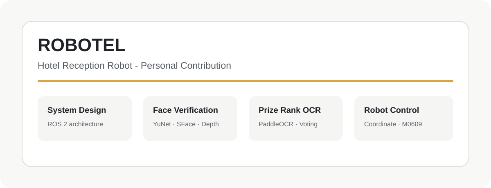
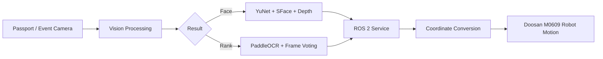

# ROBOTEL Personal Contribution

ROS 2 Humble, OpenCV, PaddleOCR, RealSense, Doosan M0609를 활용한 **호텔 리셉션 자동화 로봇 프로젝트**입니다.

이 저장소는 ROBOTEL 팀 프로젝트 전체가 아니라, **제가 직접 담당한 시스템 설계, 얼굴 본인 확인, 경품 등수 OCR, 좌표 기반 로봇 제어 부분만** 간략하게 정리한 저장소입니다.



## Quick Summary

- **Project**: 호텔 체크인·체크아웃 자동화 로봇
- **Project Type**: 5인 팀 프로젝트
- **My Role**: System Architecture · Computer Vision · Robot Control
- **Repository Scope**: 개인 담당 부분만 정리
- **Main Stack**: ROS 2 Humble, Python, OpenCV, YuNet, SFace, PaddleOCR, RealSense, Doosan M0609

## Project Overview

ROBOTEL은 키오스크, 비전/OCR, 음성 안내, DB, 협동로봇을 연결하여 호텔 체크인·체크아웃과 실물 전달 업무를 자동화한 프로젝트입니다.

전체 시스템 중 제가 담당한 부분은 다음과 같습니다.

## My Role

### 1. 시스템 구조 설계

- Kiosk / Flask / ROS 2 / Vision / Robot / DB Manager 연결 구조 설계
- ROS 2 Service·Topic 기반 기능 분리
- 비전 결과가 로봇 동작으로 연결되는 흐름 정리

### 2. 얼굴 본인 확인

- YuNet 기반 얼굴 검출
- SFace 특징 벡터 비교
- 여권 사진과 실시간 얼굴 유사도 판정
- 여러 프레임 결과를 이용한 안정화
- RealSense Depth를 활용한 거리·입체 정보 보조 검증

### 3. 경품 등수 OCR

- PaddleOCR 기반 `1등~4등` 문자 인식
- 숫자만 인식된 결과는 제외
- OCR 신뢰도와 여러 프레임 투표를 이용한 결과 안정화
- ROS 2 Service / Topic 기반 이벤트 기능 연동

### 4. 좌표 기반 로봇 제어

- 카메라 좌표를 로봇 Base 좌표로 변환
- 여권 파지 위치와 자세 계산
- 고정 좌표와 안전 경유점을 이용한 반복 동작 구성
- Doosan M0609의 `movej`, `movel` 기반 pick-and-place 구현

## Contribution Workflow



## Representative Code

| File | Description |
|---|---|
| `src/face_verification/verification_node.py` | 여권 사진과 실시간 얼굴 비교, Depth 보조 검증 |
| `src/rank_ocr/realtime_rank_ocr_paddle.py` | PaddleOCR 기반 경품 등수 인식 및 다중 프레임 투표 |
| `src/robot_control/passport_grasp_pose_service_node.py` | 카메라 좌표를 Base 좌표로 변환하고 여권 파지점 계산 |
| `src/robot_control/passport_robot_motion_node.py` | 계산된 좌표와 고정 경유점을 이용한 여권 pick-and-place |

## Repository Structure

```text
robotel-personal-contribution/
├── README.md
├── src/
│   ├── face_verification/
│   ├── rank_ocr/
│   └── robot_control/
└── media/
    └── robotel_contribution.svg
```

## Note

이 프로젝트는 팀 프로젝트로 진행되었습니다. 이 저장소는 전체 키오스크, DB, 음성 안내, 체크인·체크아웃 기능을 모두 공개하는 저장소가 아니라 **제가 담당한 비전 및 로봇 제어 부분을 포트폴리오 형태로 정리한 저장소**입니다.

대표 코드는 원본 ROS 2 워크스페이스에서 분리한 것으로, 단독 실행에는 ROS 2 인터페이스, 모델 파일, RealSense 및 Doosan 로봇 환경이 추가로 필요합니다.
