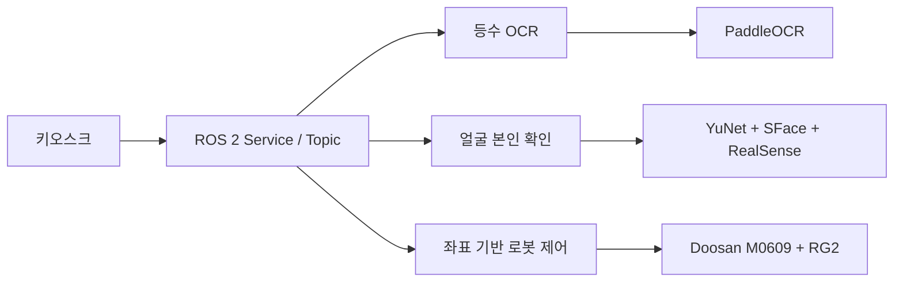

# ROBOTEL — Vision & Robot Control

호텔 체크인·체크아웃 자동화 시스템 **ROBOTEL**에서 제가 직접 담당한 기능만 간단히 정리한 포트폴리오 저장소입니다.

> 담당 역할: **뽑기 등수 OCR · 좌표 기반 로봇 제어 · 얼굴 본인 확인 · 시스템 설계**

## 프로젝트 한눈에 보기

| 항목 | 내용 |
|---|---|
| 기간 | 2026.07.15 ~ 2026.07.29 |
| 형태 | 5인 팀 프로젝트 |
| 로봇 | Doosan M0609 + OnRobot RG2 |
| 환경 | Ubuntu 22.04, ROS 2 Humble, Python 3.10 |
| 핵심 기술 | PaddleOCR, OpenCV YuNet/SFace, RealSense RGB-D |

ROBOTEL은 키오스크, 비전/OCR, 음성 안내, DB, 협동로봇을 연결해 호텔의 반복적인 체크인·체크아웃 업무를 자동화한 프로젝트입니다.

## 내가 구현한 기능

### 1. 뽑기 등수 OCR

카메라 영상에서 `1등`~`4등` 문구를 읽어 이벤트 결과로 전달했습니다.

- PaddleOCR 기반 한글 등수 인식
- ROI, CLAHE, Sharpen, Otsu 전처리 비교
- 숫자만 인식된 결과는 제외해 오검출 방지
- 여러 프레임의 결과를 투표해 최종 등수 확정

코드: [`src/rank_ocr_node.py`](src/rank_ocr_node.py)

### 2. 얼굴 본인 확인

여권 사진과 실시간 얼굴을 비교하고 RealSense Depth 조건을 함께 적용했습니다.

- YuNet 얼굴 검출
- SFace 특징 벡터 비교
- 여러 프레임의 유사도 점수 안정화
- RGB-D 기반 평면 사진 방지
- 얼굴 불일치 시 직원 호출 흐름으로 전환

코드: [`src/face_verification_node.py`](src/face_verification_node.py)

### 3. 좌표 기반 로봇 제어

시연 환경에 맞춘 고정 좌표와 경유점으로 경품을 집어 전달하는 동작을 구성했습니다.

- `movej`를 이용한 안전 자세 이동
- `movel`을 이용한 직선 접근과 이탈
- RG2 그리퍼 파지·해제
- 중복 실행 방지를 위한 Lock
- 실제 로봇 없이 확인할 수 있는 `dry_run`

코드: [`src/coordinate_robot_control.py`](src/coordinate_robot_control.py)

## 동작 구조



## 검증 결과

| 기능 | 결과 |
|---|---|
| 동일인 얼굴 인증 | 20/20 통과 |
| 타인 얼굴 인증 | 0/20 통과 |
| 여권 평면 사진 | 0/20 통과 |
| 팀 통합 로봇 동작 | 20/20 성공 |

뽑기 등수 OCR은 통합 시연까지 완료했으나 결과보고서에 별도의 정량 정확도는 기록하지 않았습니다.

## 파일 구성

```text
.
├── README.md
├── requirements.txt
├── .gitignore
└── src/
    ├── rank_ocr_node.py
    ├── face_verification_node.py
    ├── coordinate_robot_control.py
    └── onrobot.py
```

## 실행 참고

이 저장소는 **제가 구현한 핵심 코드만 발췌한 포트폴리오용 저장소**입니다. 실제 실행에는 원본 ROS 2 워크스페이스의 사용자 정의 Service, Doosan bringup, RealSense 토픽, 얼굴 모델 파일이 필요합니다.

```bash
pip install -r requirements.txt
```

RG2 주소는 환경변수로 변경할 수 있습니다.

```bash
export RG2_IP=192.168.1.1
export RG2_PORT=502
```

실제 로봇을 움직이기 전에는 반드시 `dry_run`과 저속 조건으로 먼저 확인해야 합니다.

## 공개 저장소에서 제외한 항목

- 여권 및 얼굴 촬영 이미지
- 예약 DB와 고객 정보
- `.env`, API Key, 장비별 민감 설정
- `build/`, `install/`, `log/`
- 대용량 외부 모델 파일
