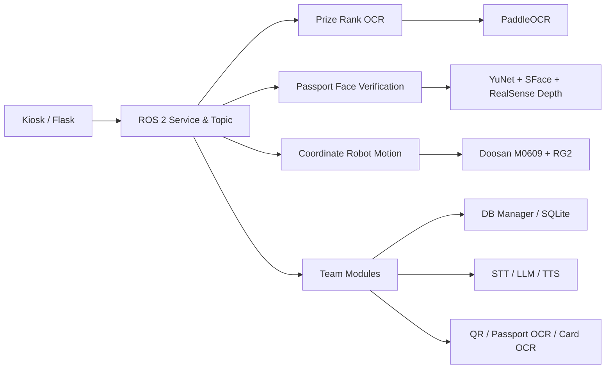

# ROBOTEL Vision & Robot Control

ROS 2 Humble, OpenCV, PaddleOCR, Intel RealSense, Doosan M0609를 활용한 호텔 리셉션 자동화 로봇 프로젝트입니다.

이 저장소는 ROBOTEL 팀 프로젝트 전체를 복제하는 저장소가 아니라, **제가 직접 담당한 시스템 설계, 뽑기 등수 OCR, 좌표 기반 로봇 제어, 얼굴 본인 확인 프로그램**을 중심으로 구현 경험과 코드를 정리한 포트폴리오용 저장소입니다.

## Quick Summary

- Program: 두산로보틱스 지능형 로보틱스 엔지니어 과정
- Project: AI 기반 호텔 리셉션 자동화 로봇 ROBOTEL
- Period: 2026.07.15 ~ 2026.07.29
- Project type: 5인 팀 프로젝트
- My role: System Design, Vision/OCR, Coordinate-based Robot Control
- Repository scope: 제가 직접 담당한 기능과 관련 코드만 정리
- Robot platform: Doosan M0609 + OnRobot RG2
- Main stack: ROS 2 Humble, Python, OpenCV, YuNet, SFace, Intel RealSense, PaddleOCR

## Important Scope Note

이 프로젝트에서 OCR 모델, 얼굴 인식 모델, 로봇 제어 알고리즘을 처음부터 학습하거나 구현한 것은 아닙니다.

제가 수행한 작업은 검증된 기술을 실제 서비스 흐름에 맞게 선택하고 연결하는 것이었습니다.

- PaddleOCR PP-OCRv5를 이용한 한글 등수 인식 전처리·후처리·다중 프레임 안정화
- YuNet 얼굴 검출과 SFace 특징 비교를 이용한 여권 사진-실시간 얼굴 비교
- RealSense Depth를 이용한 평면 사진 방지용 liveness 조건 추가
- Doosan `movej`, `movel`과 RG2 제어를 이용한 고정 좌표 기반 pick/place 시퀀스 구성
- ROS 2 Service/Topic을 이용한 키오스크·비전·로봇 기능 연결

## Project Overview

ROBOTEL은 호텔의 반복적인 체크인·체크아웃 업무를 키오스크와 협동로봇으로 보조하는 시스템입니다.

팀 전체 시스템은 다음 기능으로 구성되었습니다.

- QR 또는 예약번호 기반 예약 확인
- 여권 OCR과 얼굴 본인 확인
- 다국어 음성 안내
- 카드키 발급·회수
- 웰컴 드링크와 어메니티 전달
- 이벤트 뽑기 등수 인식과 경품 전달
- SQLite 기반 예약·객실·로그 관리
- Flask 기반 키오스크와 관리자 화면

이 저장소에서는 위 기능 중 제가 담당한 **Vision/OCR, 얼굴 검증, 좌표 기반 로봇 제어, 시스템 연결 구조**만 다룹니다.

## My Contribution Scope

### 1. 뽑기 등수 OCR

종이 뽑기판에 표시된 `1등`~`4등`을 카메라로 읽어 ROS 2 Topic과 Service로 전달하는 기능을 구현했습니다.

주요 구현 내용:

- PaddleOCR `korean_PP-OCRv5_mobile_rec` 사용
- 카메라 전체 영상이 아닌 비율 기반 ROI 적용
- Original, CLAHE, Sharpen, Otsu 전처리 결과를 함께 비교
- 숫자만 검출된 경우 등수로 확정하지 않도록 후처리
- 숫자와 `등` 계열 문자가 함께 인식된 경우에만 후보 생성
- 선명한 프레임 우선 선택
- 여러 프레임의 인식 결과를 가중 투표해 최종 등수 확정
- 시작 요청 전에는 카메라를 닫아 두고 Service 호출 시에만 사용

관련 코드: [`src/realtime_rank_ocr_paddle.py`](src/realtime_rank_ocr_paddle.py)

상세 설명: [`docs/rank_ocr.md`](docs/rank_ocr.md)

### 2. 여권 사진-실시간 얼굴 본인 확인

여권에서 추출한 얼굴 사진과 RealSense RGB 영상의 얼굴을 비교하고, Depth 조건을 함께 사용해 평면 사진을 실제 얼굴로 오인하지 않도록 구성했습니다.

주요 구현 내용:

- OpenCV YuNet 기반 얼굴 검출
- OpenCV SFace 기반 특징 벡터 추출과 cosine similarity 비교
- 여러 프레임의 유사도 점수를 median으로 안정화
- RGB와 aligned Depth 프레임의 시간 차이 확인
- 얼굴 ROI의 유효 Depth 비율과 깊이 범위 검사
- 코와 볼의 Depth 차이를 이용한 입체감 보조 검사
- 동일인·타인·판정 유보 구간을 분리한 예외 처리
- ROS 2 Service 응답과 GUI용 영상 Topic 발행

관련 코드: [`src/verification_node.py`](src/verification_node.py)

상세 설명: [`docs/face_verification.md`](docs/face_verification.md)

### 3. 좌표 기반 로봇 제어

시연 환경의 물체 위치와 트레이 위치를 고정하고, 검증한 관절 좌표와 BASE 좌표를 이용해 반복 동작의 안정성을 확보했습니다.

주요 구현 내용:

- `movej`를 이용한 안전 자세·경유 자세 이동
- `movel`을 이용한 직선 접근·하강·이탈
- RG2 그리퍼 열기·파지·해제 시퀀스
- 상단 접근 후 수직 하강하는 pick/place 흐름
- 동시 서비스 요청을 막기 위한 motion lock
- 실제 로봇 명령을 생략할 수 있는 dry-run 옵션
- 유효하지 않은 좌표와 로봇 API 반환값 예외 처리

관련 코드:

- [`src/event_prize_delivery_node.py`](src/event_prize_delivery_node.py)
- [`src/passport_robot_motion_node.py`](src/passport_robot_motion_node.py)

상세 설명: [`docs/coordinate_robot_control.md`](docs/coordinate_robot_control.md)

## System Context



전체 시스템 맥락과 제 담당 범위는 [`docs/system_architecture.md`](docs/system_architecture.md)에 정리했습니다.

## Implementation Evidence

이 저장소에는 제가 담당한 기능을 확인할 수 있도록 다음 자료를 포함했습니다.

- `src/realtime_rank_ocr_paddle.py`: PaddleOCR 기반 실시간 등수 OCR 노드
- `src/verification_node.py`: YuNet + SFace + RGB-D 얼굴 검증 노드
- `src/event_prize_delivery_node.py`: 고정 좌표 기반 3등 경품 전달 노드
- `src/passport_robot_motion_node.py`: 좌표 입력 및 고정 경유점을 이용한 여권 pick/place 노드
- `config/fixed_robot_poses.yaml`: 코드에 사용된 주요 좌표를 읽기 쉽게 정리한 참고 파일
- `docs/my_contribution.md`: 역할과 팀 기능의 경계
- `docs/troubleshooting.md`: 개발 중 발생한 문제와 해결 과정
- `docs/test_results.md`: 결과보고서에 기록된 검증 수치와 해석 범위

## Test Results

결과보고서에 기록된 얼굴 인증 테스트는 다음과 같습니다.

- 동일 사람: 20/20 인증 통과
- 다른 사람: 인증 통과 0/20
- 여권 평면 사진: 인증 통과 0/20

팀 전체 통합 테스트에서는 카드키 OCR과 로봇 동작이 각각 20/20으로 기록되었습니다. 해당 수치는 팀 통합 시나리오 결과이며, 이 저장소의 개별 코드만으로 독립 재현한 벤치마크는 아닙니다.

뽑기 등수 OCR은 기능 검증과 통합 시연을 수행했지만, 제공된 결과보고서에는 별도의 정량 정확도 수치가 기록되어 있지 않아 임의의 정확도를 제시하지 않았습니다.

자세한 내용: [`docs/test_results.md`](docs/test_results.md)

## What I Used and What I Implemented

### Used existing models and APIs

- PaddleOCR PP-OCRv5
- OpenCV YuNet
- OpenCV SFace
- Intel RealSense RGB-D
- Doosan Robotics ROS 2 API
- OnRobot RG2 interface
- ROS 2 Service / Topic

### Implemented or configured by me

- 등수 OCR 전처리 변형과 텍스트 정규화
- 숫자 단독 오인식을 막는 등수 판정 규칙
- 다중 프레임 가중 투표 기반 안정 판정
- ROS 2 기반 OCR 시작·중지·결과 Service 구성
- 여권 얼굴 특징과 실시간 얼굴 특징 비교 흐름
- RGB-D 기반 평면 사진 방지 조건
- 얼굴 유사도 다중 프레임 안정화와 예외 처리
- 고정 좌표·경유점 기반 로봇 pick/place 동작
- ROS 2 Service 기반 로봇 동작 호출과 중복 실행 방지
- 팀 시스템의 비전·로봇 연결 구조 설계

## Repository Structure

```text
.
├── README.md
├── .gitignore
├── .env.example
├── requirements.txt
├── config/
│   ├── fixed_robot_poses.yaml
│   └── rank_ocr_params.yaml
├── docs/
│   ├── my_contribution.md
│   ├── system_architecture.md
│   ├── rank_ocr.md
│   ├── face_verification.md
│   ├── coordinate_robot_control.md
│   ├── troubleshooting.md
│   ├── test_results.md
│   └── github_upload_checklist.md
├── interfaces/
│   ├── PickPassport.srv
│   └── VerifyPassportFace.srv
├── media/
│   └── README.md
└── src/
    ├── README.md
    ├── realtime_rank_ocr_paddle.py
    ├── verification_node.py
    ├── event_prize_delivery_node.py
    └── passport_robot_motion_node.py
```

## Environment

프로젝트에서 확인된 기준 환경입니다.

- Ubuntu 22.04
- ROS 2 Humble
- Python 3.10
- NumPy 1.24.4
- OpenCV Contrib 4.10.0.84
- PaddleOCR 3.x
- Intel RealSense
- Doosan M0609
- OnRobot RG2

이 저장소의 코드는 포트폴리오와 구현 근거를 위한 발췌본입니다. 실제 실행에는 원본 ROS 2 workspace의 interface package, 모델 파일, Doosan bringup, RealSense topic, RG2 wrapper가 추가로 필요합니다.

## Privacy and Repository Cleanup

원본 workspace에는 호텔 DB, 여권 사진, 실시간 얼굴 사진, `.env`, 로봇 장비 설정 등이 포함되어 있었습니다. GitHub 공개 저장소에는 다음 자료를 포함하지 않았습니다.

- `.env`와 API key
- SQLite DB와 Excel 예약 데이터
- 여권·얼굴 촬영 결과 이미지
- `build/`, `install/`, `log/`
- 대용량 학습 모델과 외부 모델 파일

업로드 전 점검 항목: [`docs/github_upload_checklist.md`](docs/github_upload_checklist.md)

## Scope and Limitation

이 저장소는 팀 전체 결과물을 개인 단독 구현으로 표현하지 않습니다.

키오스크, DB Manager, STT/LLM/TTS, 여권 MRZ OCR, 체크아웃 카드 OCR, 전체 시스템 통합 등은 팀 프로젝트 맥락에 해당합니다. 이 저장소는 제가 직접 담당했다고 확인된 **시스템 설계, 뽑기 등수 OCR, 좌표 기반 로봇 제어, 얼굴 인식 프로그램**을 중심으로 정리했습니다.

실제 로봇 좌표는 당시 고정된 시연 환경에서 검증한 값이므로 다른 장비나 작업 공간에 그대로 적용하면 안 됩니다. 실제 구동 전에는 반드시 dry-run, 저속 시험, 충돌 가능성 확인, 비상정지 준비가 필요합니다.
