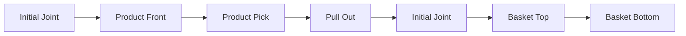

# Coordinate-based Robot Control

## 목표

고정된 호텔 리셉션 시연 환경에서 여권과 경품을 안정적으로 집고 지정 위치에 놓기 위해, 검증한 관절 좌표와 BASE 좌표를 이용한 pick/place 동작을 구현했습니다.

## 기술 선택 이유

시연 환경에서는 물체 배치와 트레이 위치가 고정되어 있었습니다. 모든 동작을 동적 비전 경로 계획으로 처리하기보다, 검증한 고정 좌표와 경유점을 조합해 반복성과 속도를 우선했습니다.

- Joint motion: `movej`
- Linear motion: `movel`
- Robot: Doosan M0609
- Gripper: OnRobot RG2
- Interface: ROS 2 Service

## Motion Design

### 원칙

낮은 위치에서 목표점으로 대각선 이동하지 않고 다음 순서를 유지했습니다.

1. 안전 자세 또는 상단 경유점으로 이동
2. 목표 XY 상단에 정렬
3. 수직 하강
4. 그리퍼 파지
5. 수직 상승 또는 안전 자세 복귀
6. 목적지 상단으로 이동
7. 수직 하강
8. 그리퍼 해제
9. 안전 위치로 이탈

## Event Prize Delivery

`event_prize_delivery_node.py`는 검증된 고정 좌표를 이용해 3등 경품 키링을 집어 바구니로 전달합니다.

구현 포인트:

- 서비스 이름을 parameter로 변경 가능
- `dry_run`으로 실제 로봇 명령 생략 가능
- motion lock으로 중복 요청 차단
- 각 단계 후 `mwait()`로 동작 완료 확인
- 그리퍼 연결을 `finally`에서 정리
- 실패 메시지에 예외 종류와 내용을 포함

## Passport Pick and Place

`passport_robot_motion_node.py`는 비전 노드가 계산한 여권 파지점 `x`, `y`, `z`를 Service로 입력받고, 고정 orientation으로 접근합니다.

### Pick

1. 파지 좌표의 finite 여부 확인
2. 그리퍼 열기
3. 입력된 BASE 좌표로 `movel`
4. 그리퍼 닫기
5. 웹캠 촬영용 관절 자세로 `movej`

### Release

1. 트레이 상단 안전 좌표로 `movel`
2. 트레이 삽입 좌표까지 직선 하강
3. 그리퍼 열기
4. 트레이 상단으로 직선 이탈
5. 사람 감지·얼굴 스캔 자세로 `movej`

## Coordinate Reference

코드에 포함된 주요 좌표는 [`config/fixed_robot_poses.yaml`](../config/fixed_robot_poses.yaml)에 문서용으로 정리했습니다. 현재 source는 YAML을 직접 읽지 않고 Python 상수를 사용합니다.

## Error Handling

- `NaN`, `inf` 좌표 거부
- `movej`, `movel` 반환값 확인
- 진행 중인 서비스의 중복 실행 거부
- 그리퍼 연결 종료 보장
- 파지 상태를 기록해 불필요한 release 동작 방지
- 실제 로봇 테스트 전 dry-run과 저속 시험 권장

## Limitation

- 좌표는 당시 시연 테이블과 로봇 설치 위치에 종속됩니다.
- 로봇 base, tool, gripper, fixture가 달라지면 재교시가 필요합니다.
- 코드만으로 충돌 안전이 보장되지 않습니다.
- 실제 작업 공간에서는 collision object, 속도 제한, force monitoring, 비상정지 절차를 추가해야 합니다.
