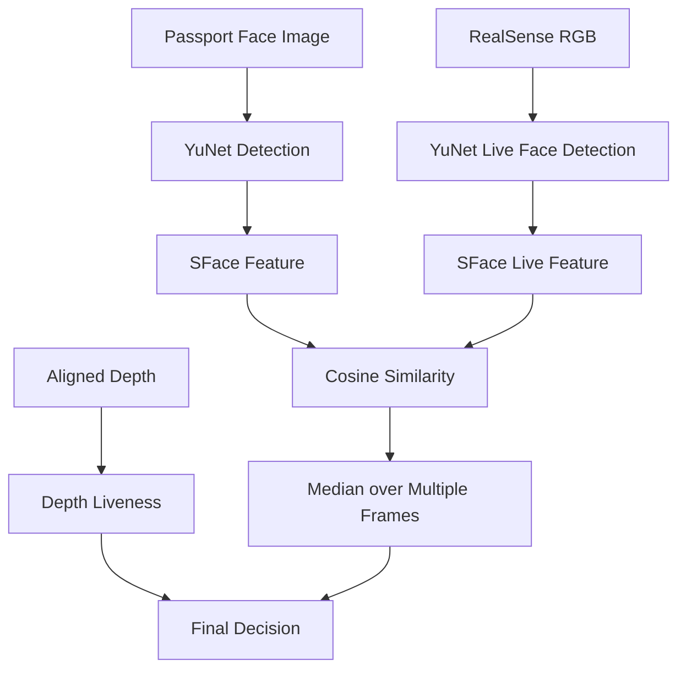

# Passport Face Verification

## 목표

여권에서 추출한 얼굴 사진과 체크인 고객의 실시간 얼굴이 동일인인지 확인하고, 여권 사진이나 휴대전화 화면 같은 평면 이미지를 실제 얼굴로 오인하지 않도록 하는 것이 목표였습니다.

## 기술 구성

- Face detection: OpenCV YuNet
- Face recognition: OpenCV SFace
- Liveness support: Intel RealSense aligned Depth
- ROS 2 interface: `VerifyPassportFace.srv`

사전학습 모델을 직접 학습한 것이 아니라, 얼굴 정렬·특징 비교·다중 프레임 안정화·Depth 검증·ROS 2 Service를 실제 체크인 흐름에 맞게 구현했습니다.

## Verification Pipeline



## Face Detection and Feature Comparison

1. 여권 얼굴과 실시간 얼굴에서 YuNet으로 얼굴을 검출합니다.
2. SFace `alignCrop`으로 얼굴을 정렬합니다.
3. SFace feature vector를 추출합니다.
4. cosine similarity로 두 feature를 비교합니다.
5. 여러 프레임의 score를 수집하고 median을 사용합니다.

한 프레임의 조명, 표정, 각도 변화가 최종 결과에 즉시 반영되지 않도록 score window를 사용했습니다.

## RGB-D Liveness Conditions

### 1. RGB/Depth frame pairing

RGB와 aligned Depth가 모두 새 프레임인지 확인하고, 두 프레임의 수신 시각 차이가 너무 크면 판정에 사용하지 않습니다.

### 2. Valid depth ratio

얼굴 ROI 안에서 설정된 거리 범위에 속하는 유효 Depth pixel 비율을 계산합니다. Depth가 너무 적으면 카메라 정렬이나 검출 상태가 불안정한 것으로 처리합니다.

### 3. Depth span

얼굴 ROI의 10 percentile과 90 percentile 차이를 계산합니다.

- span이 너무 작으면 평면으로 판단
- span이 너무 크면 배경이 얼굴 ROI에 섞인 것으로 판단

### 4. Nose protrusion

YuNet landmark의 코 위치와 눈-입 사이의 볼 위치에서 작은 Depth patch의 median을 계산합니다.

```text
nose_protrusion = cheek_depth - nose_depth
```

코가 볼보다 충분히 앞에 있지 않으면 평면 얼굴 profile로 처리합니다.

## Decision States

- `verified`: liveness 통과 + similarity가 same threshold 이상
- `different_person`: liveness 통과 + similarity가 different threshold 이하
- `face_match_uncertain`: 두 threshold 사이
- `flat_surface_detected`: 얼굴 ROI의 깊이 변화 부족
- `flat_face_profile_detected`: 코와 볼의 깊이 차이 부족
- `depth_data_insufficient`: 유효 Depth 부족
- `one_person_only`: 여러 얼굴이 동시에 검출됨

## Configurable Parameters

현재 제공된 source default는 환경변수로 조정할 수 있습니다.

| Environment variable | Source default |
|---|---:|
| `FACE_SAME_THRESHOLD` | 0.40 |
| `FACE_DIFFERENT_THRESHOLD` | 0.32 |
| `FACE_SCORE_WINDOW_SIZE` | 15 |
| `FACE_MIN_SCORE_COUNT` | 8 |
| `FACE_VERIFY_TIMEOUT_SEC` | 15.0 s |
| `FACE_MIN_DISTANCE_MM` | 300 mm |
| `FACE_MAX_DISTANCE_MM` | 1500 mm |
| `FACE_MIN_DEPTH_VALID_RATIO` | 0.45 |
| `FACE_MIN_DEPTH_SPAN_MM` | 18 mm |
| `FACE_MAX_DEPTH_SPAN_MM` | 220 mm |
| `FACE_MIN_NOSE_PROTRUSION_MM` | 6 mm |

## Test Result from Project Report

- 동일 사람: 20/20 통과
- 다른 사람: 통과 0/20
- 여권 평면 사진: 통과 0/20

결과보고서의 별도 페이지에는 테스트 당시 최종 임계값 `0.554`가 기록되어 있습니다. 반면 제공된 source snapshot의 기본 환경값은 `same=0.40`, `different=0.32`입니다. 이는 테스트 시점과 source snapshot의 tuning 상태가 다를 가능성이 있으므로, 두 값을 동일한 최종 설정으로 단정하지 않았습니다.

## Privacy Note

원본 프로그램은 디버깅을 위해 얼굴 crop을 파일로 저장할 수 있습니다. 공개 저장소에는 촬영된 여권 사진과 실시간 얼굴 이미지를 포함하지 않았으며, 실제 운영에서는 보관 기간, 접근 권한, 암호화, 사용자 동의 정책을 별도로 설계해야 합니다.
