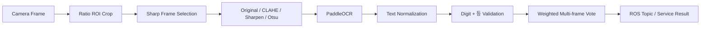

# Prize Rank OCR

## 목표

카메라에 제시된 종이 뽑기 결과에서 `1등`, `2등`, `3등`, `4등` 중 하나를 안정적으로 인식하고, 키오스크와 로봇 제어 노드가 사용할 수 있도록 ROS 2 인터페이스로 전달하는 것이 목표였습니다.

## 기술 선택

한글 `등`과 숫자를 함께 읽는 것이 핵심이었기 때문에 PaddleOCR의 한국어 text recognition model을 사용했습니다.

- Model: `korean_PP-OCRv5_mobile_rec`
- Engine: Paddle static inference
- Target labels: `1등`, `2등`, `3등`, `4등`

모델을 새로 학습한 것이 아니라, 실제 시연 환경에서 안정적으로 사용할 수 있도록 카메라 입력, 전처리, 후처리, 다중 프레임 판정을 구현했습니다.

## Processing Pipeline



## ROI

기본 ROI는 프레임 크기에 대한 비율로 정의했습니다.

```text
x=0.33, y=0.40, width=0.34, height=0.20
```

해상도가 바뀌어도 같은 상대 위치를 사용할 수 있고, `rank_roi.json`으로 조정할 수 있도록 구성했습니다.

## Preprocessing

한 프레임에서 다음 네 가지 입력을 생성하고 OCR 결과를 비교합니다.

1. Original resized image
2. CLAHE grayscale image
3. Sharpened image
4. Otsu threshold image

문자 높이를 일정하게 맞추고, 너무 넓은 이미지는 최대 폭으로 제한해 recognition model의 입력 변화를 줄였습니다.

## False Positive Rejection

배경 선, ROI 테두리, 종이가 일부만 보이는 상황에서 숫자 하나만 검출되는 문제가 있었습니다.

이를 줄이기 위해 다음 규칙을 적용했습니다.

- 숫자 `1`~`4`만 검출된 결과는 거부
- 숫자와 `등`이 함께 존재해야 정상 후보
- OCR 오인식을 고려해 `둥`, `동`, `듬`, `듕`, `응`을 낮은 가중치 후보로 처리
- `I`, `l`, `|`, 원문자 숫자를 일반 숫자로 정규화
- 낮은 model score는 후보에서 제외

## Multi-frame Stabilization

단일 프레임 결과로 즉시 확정하지 않고 최근 결과를 누적했습니다.

현재 코드의 주요 값:

| Parameter | Value | Purpose |
|---|---:|---|
| OCR frame interval | 4 frames | OCR 호출 빈도 제한 |
| Sharp frame pool | 4 | 최근 프레임 중 선명한 ROI 선택 |
| Vote window | 12 | 최근 후보 유지 |
| Minimum vote count | 5 | 최소 반복 횟수 |
| Minimum vote weight | 2.75 | 누적 confidence 기준 |
| Winner margin | 0.45 | 1위와 2위 후보 차이 |
| Minimum accept score | 0.55 | 단일 OCR 후보 하한 |
| Minimum visible time | 2.0 s | 너무 빠른 확정 방지 |

## ROS 2 Integration

카메라는 항상 점유하지 않고 Start Service가 호출되면 열도록 구성했습니다.

- `/event/rank_ocr/start`: 카메라 열기 및 OCR 시작
- `/event/rank_ocr/stop`: OCR 중지 및 카메라 해제
- `/event/rank_ocr/result`: 최근 안정 판정 결과 반환
- `/event/rank_ocr/detected`: `Int32`로 1~4 발행, 미확정 시 0

OCR과 키오스크가 서로 다른 프레임을 보지 않도록 OCR에 사용한 동일 카메라 프레임을 image topic으로 발행했습니다.

## Implementation Notes

- OCR inference는 worker thread에서 실행해 ROS timer callback을 막지 않도록 했습니다.
- 입력·출력 queue는 최신 결과 중심으로 유지해 오래된 OCR 결과가 쌓이지 않도록 했습니다.
- Paddle import가 실패해도 ROS Service는 유지하고 오류 상태를 결과로 확인할 수 있게 했습니다.
- 카메라 장치 경로는 PC마다 다르므로 `/dev/v4l/by-id/` 사용을 권장합니다.

## Quantitative Limitation

제공된 결과보고서에는 뽑기 등수 OCR의 별도 정량 정확도 수치가 기록되어 있지 않습니다. 따라서 이 저장소에서는 기능 검증과 구현 방식만 설명하고 임의의 정확도를 제시하지 않습니다.
