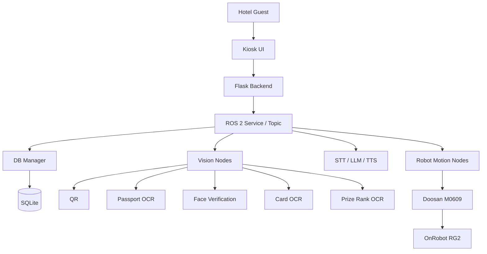
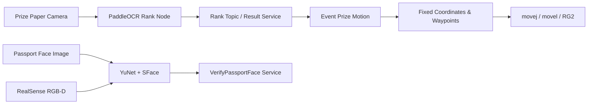

# System Architecture

## 전체 시스템 맥락

ROBOTEL은 키오스크에서 시작된 사용자 요청을 ROS 2 Service와 Topic으로 비전, 음성, DB, 로봇 노드에 전달하는 구조입니다.

## 제 담당 범위

## 노드 인터페이스

### 등수 OCR

- Start Service: `/event/rank_ocr/start`
- Stop Service: `/event/rank_ocr/stop`
- Result Service: `/event/rank_ocr/result`
- Rank Topic: `/event/rank_ocr/detected`
- Camera Topic: `/hand_teleop/event_ocr_camera/image_raw`

### 얼굴 검증

- Service: `/passport/verify_face`
- Result Topic: `/passport/face_verified`
- Stream Topic: `/robotel/vision/face_verification/image`
- RGB Topic: `/camera/camera/color/image_raw`
- Aligned Depth Topic: `/camera/camera/aligned_depth_to_color/image_raw`

### 좌표 기반 로봇 제어

- Event prize Service: `/event/deliver_keyring`
- Passport pick Service: `/checkin/pick_passport`
- Passport detection pose Service: `/checkin/move_to_passport_detection_pose`
- Passport release Service: `/checkin/release_passport_and_move_to_face`

## 설계 판단

- 데이터베이스는 DB Manager를 통해 접근해 여러 노드의 직접 파일 접근을 줄였습니다.
- 카메라와 OCR은 항상 실행하지 않고, 필요한 시나리오에서만 활성화해 자원 사용을 줄였습니다.
- 얼굴 인증은 2D similarity와 Depth liveness를 분리한 뒤 최종 단계에서 함께 판정했습니다.
- 고정 시연 환경의 로봇 동작은 검증한 좌표와 경유점을 사용해 반복성과 시연 안정성을 우선했습니다.
